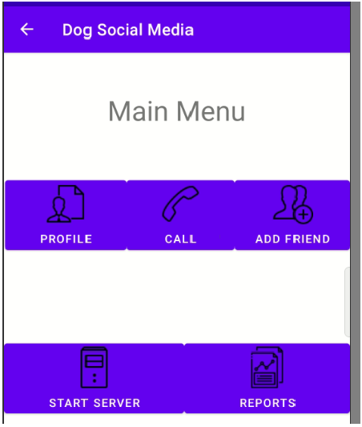
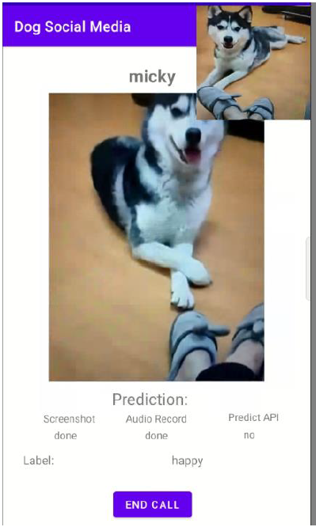
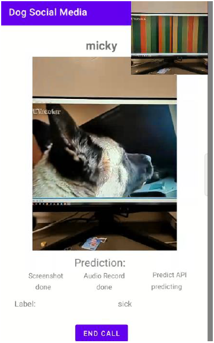
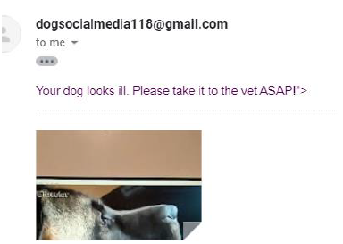
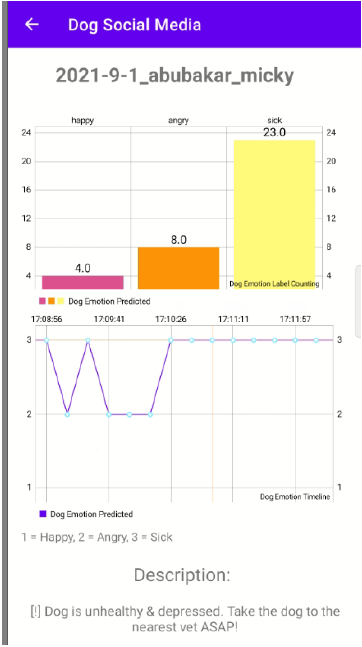
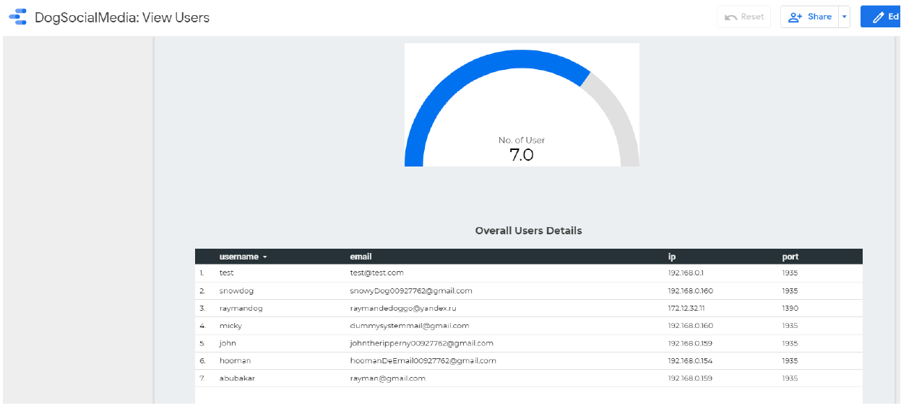
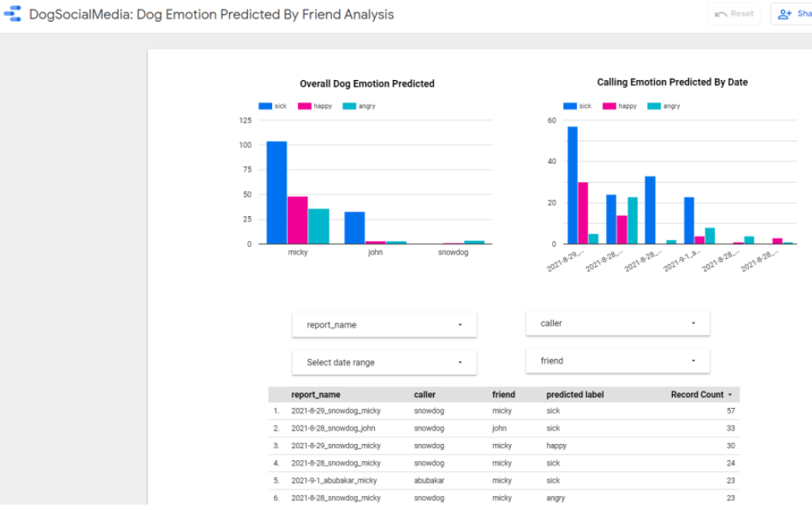
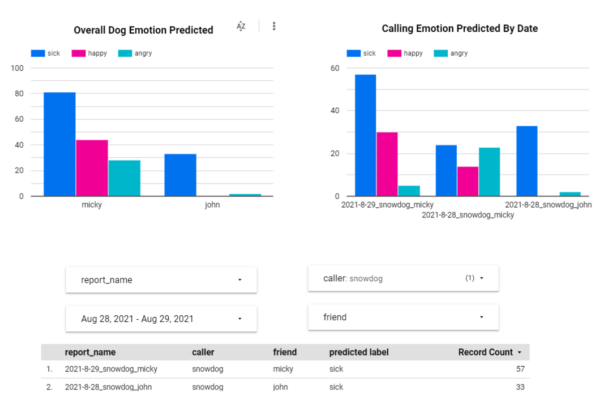

# Final Year Project
 DEVELOP A SMART ENVIRONMENT FOR DOG SOCIAL NETWORK

## Android App

### Main Menu 

### Calling Interface

//dog detected sick during call (Sent Email To Dog's Owner) 

### Report Graphs

## Google Data Studio (Data Visualization)

